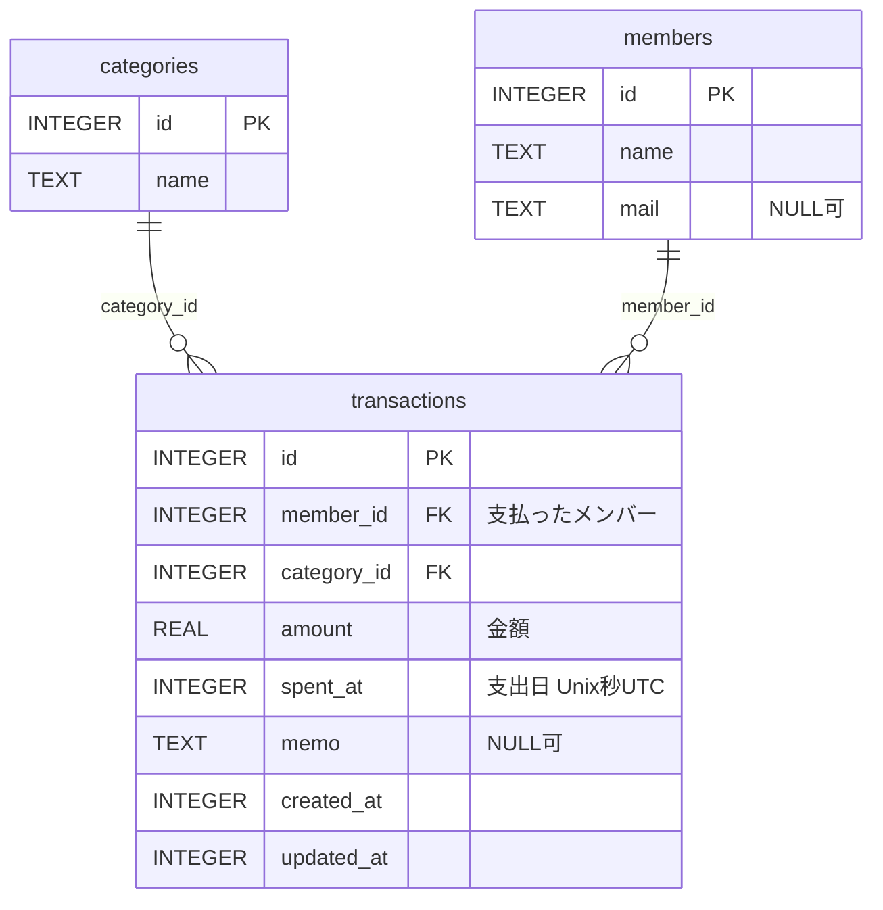

# DB スキーマ

LedgerCore のデータはすべて [drift](https://drift.simonbinder.eu/)（SQLite）で端末内の
`ledgercore.sqlite` に保存される。サーバも REST API も存在しないので、ここに書かれている
3 テーブルがアプリの持つデータのすべて。

- **定義元** — [`lib/db/database.dart`](../lib/db/database.dart)。`database.g.dart` は `build_runner` の生成物
- **`schemaVersion`** — 現在 `3`（`transactions.amount` の CHECK 制約を段階的に強めてきた。[マイグレーション履歴](#マイグレーション履歴)を参照）
- このドキュメントと実装が食い違った場合は `database.dart` が正。スキーマを変更したらこのファイルも更新する

Dart 側の識別子は camelCase だが、drift が実際の SQL 名を **snake_case** に変換する
（`memberId` → `member_id`、`spentAt` → `spent_at`）。SQLite を直接触るときは snake_case の方を使う。
以下の図・表はすべて実 SQL 名で書いてある。

## ER 図



`transactions` が両テーブルを参照する多側で、`categories` と `members` の間に直接の関連はない。
中間テーブルや履歴テーブルの類は存在しない。

## テーブル定義

### categories — カテゴリ

```sql
CREATE TABLE "categories" (
  "id"   INTEGER NOT NULL PRIMARY KEY AUTOINCREMENT,
  "name" TEXT NOT NULL
)
```

| カラム（SQL） | Dart 側 | 型 | 制約 | 説明 |
| --- | --- | --- | --- | --- |
| `id` | `id` | INTEGER | PK / AUTOINCREMENT | |
| `name` | `name` | TEXT | NOT NULL | カテゴリ名。1〜50 文字（後述のとおり検証は Dart 側） |

初回起動時（`MigrationStrategy.onCreate`）に既定カテゴリ 10 件（食費・日用品・交通費・光熱費・通信費・
住居費・医療費・娯楽費・衣服・その他）が投入される。

### members — メンバー（割り勘の対象者）

```sql
CREATE TABLE "members" (
  "id"   INTEGER NOT NULL PRIMARY KEY AUTOINCREMENT,
  "name" TEXT NOT NULL,
  "mail" TEXT NULL
)
```

| カラム（SQL） | Dart 側 | 型 | 制約 | 説明 |
| --- | --- | --- | --- | --- |
| `id` | `id` | INTEGER | PK / AUTOINCREMENT | |
| `name` | `name` | TEXT | NOT NULL | メンバー名。1〜50 文字 |
| `mail` | `mail` | TEXT | NULL 可 | **現状は常に NULL**（下記） |

初回起動時に既定メンバー「自分」が 1 件投入される。

`mail` は DAO `insertMember(name, {mail})` が引数として受け取るものの、
`lib/screens/members_screen.dart` にメールアドレスの入力欄がないため、UI 経由では常に NULL になる。
現時点で読み出して使っている画面もない。

### transactions — 取引

```sql
CREATE TABLE "transactions" (
  "id"          INTEGER NOT NULL PRIMARY KEY AUTOINCREMENT,
  "member_id"   INTEGER NOT NULL REFERENCES members (id),
  "category_id" INTEGER NOT NULL REFERENCES categories (id),
  "amount"      REAL NOT NULL CHECK (("amount" > 0.0 AND "amount" <= 999999999999.0)
                                     AND (amount = CAST(amount AS INTEGER))),
  "spent_at"    INTEGER NOT NULL,
  "memo"        TEXT NULL,
  "created_at"  INTEGER NOT NULL,
  "updated_at"  INTEGER NOT NULL
)
```

| カラム（SQL） | Dart 側 | 型 | 制約 | 説明 |
| --- | --- | --- | --- | --- |
| `id` | `id` | INTEGER | PK / AUTOINCREMENT | |
| `member_id` | `memberId` | INTEGER | NOT NULL / FK → `members.id` | 支払ったメンバー |
| `category_id` | `categoryId` | INTEGER | NOT NULL / FK → `categories.id` | |
| `amount` | `amount` | REAL | NOT NULL / CHECK `0 < amount <= 999999999999` かつ整数 | 金額。0 と負の値・上限超過（`Infinity` を含む）・小数はすべて DB が弾く。**型は REAL のまま**（下記） |
| `spent_at` | `spentAt` | INTEGER | NOT NULL | 支出日。Unix 秒（UTC） |
| `memo` | `memo` | TEXT | NULL 可 | |
| `created_at` | `createdAt` | INTEGER | NOT NULL | 作成日時。`clientDefault` |
| `updated_at` | `updatedAt` | INTEGER | NOT NULL | 更新日時。`clientDefault` |

`created_at` / `updated_at` は drift の `clientDefault` で、**SQL の DEFAULT ではなく Dart 側が
`DateTime.now()` を入れている**。DDL に DEFAULT 句がないので、drift を経由せず直接 INSERT すると
NOT NULL 違反になる。`updated_at` を更新するのは `updateTransaction` だけで、
どちらのカラムも表示用モデル `TransactionResponse` には載らない（画面には出てこない）。

## スキーマを読むときの注意

### 文字数制限は SQL の制約ではない

`name` の `withLength(min: 1, max: 50)` は **drift による Dart 側のバリデーション**で、
CREATE TABLE に `CHECK` 制約は生成されない。違反すると SQLite ではなく drift が
`InvalidDataException` を投げる。SQLite を直接触って 51 文字を書き込めば、DB 側は素通しする。

### `amount` は整数しか入らないが型は REAL

CHECK に `amount = CAST(amount AS INTEGER)` があるので、v3 以降の `amount` は必ず整数。
それでも `IntColumn` にしていないのは、表示用モデル・集計・グラフまで `int` が波及する一方で、
割り勘の `fairShare`（`合計 ÷ メンバー数`）は本質的に小数として残るため。
`double` と `int` が混ざるより、入力値も導出値も `double` で揃っている方が扱いやすい。

`Infinity` は `> 0` を満たすので、上限が無いと CHECK を素通りする。上限はそのための制約でもある。
`NaN` は SQLite が NULL として保存するため、CHECK ではなく NOT NULL に弾かれる。

### DateTime は INTEGER（Unix 秒・UTC）

`storeDateTimeAsText` を設定していないため、drift の既定どおり Unix 秒の INTEGER として保存される。
値は UTC で、Dart 側で読み出すとローカル時刻の `DateTime` に戻る。
SQLite を直接覗くときは変換が要る。

```sql
SELECT datetime(spent_at, 'unixepoch') FROM transactions;   -- UTC で表示される
```

たとえば JST の 2026-07-15 10:30 に登録した取引は、`spent_at = 1784079000`、
上記クエリでは `2026-07-15 01:30:00`（UTC）として見える。

### 外部キーは有効。参照中のカテゴリ・メンバーは削除できない

`beforeOpen` で `PRAGMA foreign_keys = ON` を実行しているため、外部キー制約は実際に効く。
`ON DELETE` は指定していない（NO ACTION）ので、取引から参照されているカテゴリやメンバーを
削除しようとすると `SqliteException(787): FOREIGN KEY constraint failed` になる。
存在しない `member_id` / `category_id` を持つ取引の INSERT も同じく失敗する。

カスケード削除も論理削除フラグもないので、「使用中のカテゴリを消す」操作は成功しない。
`CategoryProvider` / `MemberProvider` はこの例外を捕捉し、画面側でエラーとして表示する。

### 期間の絞り込みは半開区間

`spent_at` に対する期間指定は `[start, end)` の半開区間で統一されている
（`getTransactionsByRange` / `getTransactionsByMonth`）。月なら `[月初, 翌月初)`、
年なら `[1/1, 翌年1/1)`。境界の取引が二重計上されないのはこの約束による。

## 表示用モデルとの対応

`lib/models/` のクラスは DB の行そのものではなく、JOIN 結果や計算結果を保持する表示用モデル。
`Response` / `Request` という接尾辞は付いているが、
**このアプリに HTTP は一切介在しない**。読み出し用（`Response`）と書き込み用（`Request`）の区別でしかない。

| 表示用モデル | 対応するテーブル | 備考 |
| --- | --- | --- |
| `CategoryResponse` | `categories` | `id` / `name` のみ |
| `HouseholdMember` | `members` | `id` / `name` / `mail` |
| `TransactionResponse` | `transactions` + `members` + `categories` の JOIN | 下記の命名の注意を参照 |
| `TransactionRequest` | 書き込み用の入力 | `userId` が `member_id` に入る |
| `MonthlySummaryResponse` / `YearlySummaryResponse` / `CategorySummaryItem` / `UserSummaryItem` / `PeriodTotal` | なし | `summary_calculator.dart` が取引リストから計算する導出値。DB には保存されない |
| `SplitResponse` / `UserBalance` | なし | 同上（割り勘の計算結果） |

### `userId` / `userName` は members を指す

`TransactionResponse` と `TransactionRequest` のフィールド名も REST API 時代の名残で、
**`Users` テーブルは存在しない**。対応は次のとおり。

| モデルのフィールド | 実際の出どころ |
| --- | --- |
| `TransactionResponse.userId` | `members.id` |
| `TransactionResponse.userName` | `members.name` |
| `TransactionResponse.categoryId` | `categories.id` |
| `TransactionResponse.categoryName` | `categories.name` |
| `TransactionRequest.userId` | `transactions.member_id` に書き込まれる |

`UserSummaryItem.userId` / `userName`、`UserBalance.userId` / `userName` も同じくメンバーを指す。

## スキーマを変更するとき

手順の正本は [CLAUDE.md](../CLAUDE.md) の「DB スキーマ変更時の注意」。
コード生成物（`lib/db/database.g.dart` / `drift_schemas/` / `test/generated_migrations/`）を
どう再生成するかもそちらに書いてある。**このドキュメントに手順を書き写さないこと** —
二重管理になり、片方だけ更新されて食い違う。

このドキュメント側でやることは 1 つだけ。**上のテーブル定義・ER 図・マイグレーション履歴を、
スキーマ変更と同じコミットで更新する。**

既にアプリを起動したことのある端末には旧スキーマの DB ファイルが残っているので、
`onUpgrade` を書かないと実行時エラーになる。

### マイグレーション履歴

| バージョン | 内容 |
| --- | --- |
| 1 | 初版（`categories` / `members` / `transactions`） |
| 2 | `transactions.amount` に `CHECK (amount > 0)` を追加 |
| 3 | `transactions.amount` に上限（`<= 999999999999`）と整数条件を追加 |

SQLite は既存カラムへの CHECK 追加をサポートしないため、`onUpgrade` は
drift の `TableMigration` で `transactions` を作り直している。作り直しは新テーブルへの
コピーを伴うので、制約違反の行が残っていると移行そのものが失敗する。そのため
コピー前に既存データを整えている。

v1 からの移行:

- 負の金額 → マイナス記号の打ち間違いとみなして**絶対値に補正**（行は残るが、元の金額は残らない）
- 0 円 → 集計上意味を持たないので**行ごと削除**

v2 からの移行（v1 からの場合は上記に続けて実行される）:

- 上限超過（`Infinity` を含む）→ 誤入力とみなして**行ごと削除**
- 四捨五入すると 0 になる金額（`0 < amount < 0.5`）→ v2 の 0 円と同じ扱いで**行ごと削除**
- 残った小数 → **四捨五入**。SQLite の `ROUND` は half away from zero で、表示側の `NumberFormat('#,###')` と同じ丸め方なので、**行ごとの表示額は変わらない**（`1234.5` はどちらも `1,235`）

ただし**合計は変わりうる**。「和を丸めた値」と「丸めた値の和」は別物なので、`100.6` が 2 件あると移行前の合計表示 `¥201` が移行後は `¥202` になる。上で削除される行（`0 < amount < 0.5`）が寄与していた分も合計から減る。

**この書き換えは不可逆で、バックアップも取っていない。** 元の値を復元する手段はなく、
補正された行の分だけ月次合計が変わる（`-2000` が `+2000` になれば合計は 4000 円ずれる）。
移行後にユーザーへ通知する仕組みも無い。

順序には意味がある。**四捨五入で 0 になる行の削除は、四捨五入より先に実行する。**
v2 のテーブルには `CHECK (amount > 0.0)` が付いており、テーブルを作り直す前の
`UPDATE ... SET amount = ROUND(amount)` で 0 を書き込むと、その時点の制約に弾かれて
移行が失敗する。v1 のテーブルには CHECK が無いので、逆順にすると **v2 起点の移行だけが落ちる**。

同じ理由で、**データ整形をすべて済ませてから最後に一度だけ `alterTable` を呼ぶ**。
`TableMigration` は「そのとき Dart 側に書かれている最新の定義」でテーブルを作るため、
v1 用のブロックの中で呼ぶと、v1 の端末では小数を持ったまま v3 の CHECK を持つテーブルへ
コピーすることになり、v1 → v3 の直行だけが失敗する。

`onUpgrade` 全体は `transaction()` で包んである。drift は `onUpgrade` を
トランザクションで包まないため、包まないと「クリーンアップだけコミット済み・
`alterTable` は失敗してスキーマは旧版のまま・`user_version` も旧版のまま」という
中間状態で固定されうる（`alterTable` はテーブル全体をコピーするので、
容量不足で失敗する余地が現実にある）。

検証は [`test/database_migration_test.dart`](../test/database_migration_test.dart)。
起点の DB は `drift_schemas/*.json` に固定した各バージョンの記録から drift の `SchemaVerifier` に
組み立てさせる（インメモリのまま、同じ生の接続を使い回すのでデータは消えない）。
最新版以外のすべてのバージョンを起点にして最新版まで通し、移行後のスキーマが
最新の定義と一致することも検証する。
移行後に主キー `id` が保たれること・外部キー制約が引き継がれることも併せて確認している
（どちらもテーブル再作成で壊れうるが、壊れても金額のアサーションだけでは気付けないため）。

検証の対象バージョンはテストにリテラルで書かず、`GeneratedHelper.versions`（生成物）から採る。
`migrateAndValidate(db, 3)` のようにリテラルで書くと、drift は `AppDatabase.schemaVersion` では
なく引数の値まで移行するため、`schemaVersion` を 4 に上げてもテストは v1 → v3 だけを見たまま
グリーンになる。あわせて「`schemaVersion` と固定スキーマの最新版が一致すること」と
「新規作成時（`onCreate`）のスキーマが最新の固定スキーマと一致すること」も検証している。
後者が無いと、移行で作り直されない `categories` / `members` の定義変更を取りこぼす
（移行のテストは「ヘルパ旧版が作った形」対「ヘルパ新版の形」の比較で、
`lib/db/database.dart` の定義が一度も登場しないため）。
