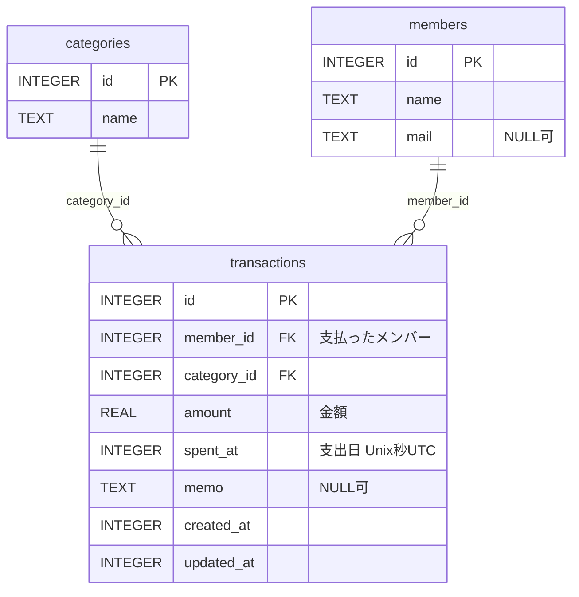

# DB スキーマ

LedgerCore のデータはすべて [drift](https://drift.simonbinder.eu/)（SQLite）で端末内の
`ledgercore.sqlite` に保存される。サーバも REST API も存在しないので、ここに書かれている
3 テーブルがアプリの持つデータのすべて。

- **定義元** — [`lib/db/database.dart`](../lib/db/database.dart)。`database.g.dart` は `build_runner` の生成物
- **`schemaVersion`** — 現在 `2`（v1 → v2 で `transactions.amount` に `CHECK (amount > 0)` を追加）
- このドキュメントと実装が食い違った場合は `database.dart` が正。スキーマを変更したらこのファイルも更新する

Dart 側の識別子は camelCase だが、drift が実際の SQL 名を **snake_case** に変換する
（`memberId` → `member_id`、`spentAt` → `spent_at`）。SQLite を直接触るときは snake_case の方を使う。
以下の図・表はすべて実 SQL 名で書いてある。

## ER 図



`transactions` が両テーブルを参照する多側で、`categories` と `members` の間に直接の関連はない。
中間テーブルや履歴テーブルの類は存在しない。

## テーブル定義

### categories — カテゴリ

```sql
CREATE TABLE "categories" (
  "id"   INTEGER NOT NULL PRIMARY KEY AUTOINCREMENT,
  "name" TEXT NOT NULL
)
```

| カラム（SQL） | Dart 側 | 型 | 制約 | 説明 |
| --- | --- | --- | --- | --- |
| `id` | `id` | INTEGER | PK / AUTOINCREMENT | |
| `name` | `name` | TEXT | NOT NULL | カテゴリ名。1〜50 文字（後述のとおり検証は Dart 側） |

初回起動時（`MigrationStrategy.onCreate`）に既定カテゴリ 10 件（食費・日用品・交通費・光熱費・通信費・
住居費・医療費・娯楽費・衣服・その他）が投入される。

### members — メンバー（割り勘の対象者）

```sql
CREATE TABLE "members" (
  "id"   INTEGER NOT NULL PRIMARY KEY AUTOINCREMENT,
  "name" TEXT NOT NULL,
  "mail" TEXT NULL
)
```

| カラム（SQL） | Dart 側 | 型 | 制約 | 説明 |
| --- | --- | --- | --- | --- |
| `id` | `id` | INTEGER | PK / AUTOINCREMENT | |
| `name` | `name` | TEXT | NOT NULL | メンバー名。1〜50 文字 |
| `mail` | `mail` | TEXT | NULL 可 | **現状は常に NULL**（下記） |

初回起動時に既定メンバー「自分」が 1 件投入される。

`mail` は DAO `insertMember(name, {mail})` が引数として受け取るものの、
`lib/screens/members_screen.dart` にメールアドレスの入力欄がないため、UI 経由では常に NULL になる。
派生元 `Ledger` のユーザーテーブルの名残で、現時点で読み出して使っている画面もない。

### transactions — 取引

```sql
CREATE TABLE "transactions" (
  "id"          INTEGER NOT NULL PRIMARY KEY AUTOINCREMENT,
  "member_id"   INTEGER NOT NULL REFERENCES members (id),
  "category_id" INTEGER NOT NULL REFERENCES categories (id),
  "amount"      REAL NOT NULL CHECK ("amount" > 0),
  "spent_at"    INTEGER NOT NULL,
  "memo"        TEXT NULL,
  "created_at"  INTEGER NOT NULL,
  "updated_at"  INTEGER NOT NULL
)
```

| カラム（SQL） | Dart 側 | 型 | 制約 | 説明 |
| --- | --- | --- | --- | --- |
| `id` | `id` | INTEGER | PK / AUTOINCREMENT | |
| `member_id` | `memberId` | INTEGER | NOT NULL / FK → `members.id` | 支払ったメンバー |
| `category_id` | `categoryId` | INTEGER | NOT NULL / FK → `categories.id` | |
| `amount` | `amount` | REAL | NOT NULL / CHECK `> 0` | 金額。整数ではなく `double`。支出額なので 0 と負の値は DB が弾く |
| `spent_at` | `spentAt` | INTEGER | NOT NULL | 支出日。Unix 秒（UTC） |
| `memo` | `memo` | TEXT | NULL 可 | |
| `created_at` | `createdAt` | INTEGER | NOT NULL | 作成日時。`clientDefault` |
| `updated_at` | `updatedAt` | INTEGER | NOT NULL | 更新日時。`clientDefault` |

`created_at` / `updated_at` は drift の `clientDefault` で、**SQL の DEFAULT ではなく Dart 側が
`DateTime.now()` を入れている**。DDL に DEFAULT 句がないので、drift を経由せず直接 INSERT すると
NOT NULL 違反になる。`updated_at` を更新するのは `updateTransaction` だけで、
どちらのカラムも表示用モデル `TransactionResponse` には載らない（画面には出てこない）。

## スキーマを読むときの注意

### 文字数制限は SQL の制約ではない

`name` の `withLength(min: 1, max: 50)` は **drift による Dart 側のバリデーション**で、
CREATE TABLE に `CHECK` 制約は生成されない。違反すると SQLite ではなく drift が
`InvalidDataException` を投げる。SQLite を直接触って 51 文字を書き込めば、DB 側は素通しする。

### DateTime は INTEGER（Unix 秒・UTC）

`storeDateTimeAsText` を設定していないため、drift の既定どおり Unix 秒の INTEGER として保存される。
値は UTC で、Dart 側で読み出すとローカル時刻の `DateTime` に戻る。
SQLite を直接覗くときは変換が要る。

```sql
SELECT datetime(spent_at, 'unixepoch') FROM transactions;   -- UTC で表示される
```

たとえば JST の 2026-07-15 10:30 に登録した取引は、`spent_at = 1784079000`、
上記クエリでは `2026-07-15 01:30:00`（UTC）として見える。

### 外部キーは有効。参照中のカテゴリ・メンバーは削除できない

`beforeOpen` で `PRAGMA foreign_keys = ON` を実行しているため、外部キー制約は実際に効く。
`ON DELETE` は指定していない（NO ACTION）ので、取引から参照されているカテゴリやメンバーを
削除しようとすると `SqliteException(787): FOREIGN KEY constraint failed` になる。
存在しない `member_id` / `category_id` を持つ取引の INSERT も同じく失敗する。

カスケード削除も論理削除フラグもないので、「使用中のカテゴリを消す」操作は成功しない。
`CategoryProvider` / `MemberProvider` はこの例外を捕捉し、画面側でエラーとして表示する。

### 期間の絞り込みは半開区間

`spent_at` に対する期間指定は `[start, end)` の半開区間で統一されている
（`getTransactionsByRange` / `getTransactionsByMonth`）。月なら `[月初, 翌月初)`、
年なら `[1/1, 翌年1/1)`。境界の取引が二重計上されないのはこの約束による。

## 表示用モデルとの対応

`lib/models/` のクラスは DB の行そのものではなく、JOIN 結果や計算結果を保持する表示用モデル。
`Response` / `Request` という接尾辞は派生元 `Ledger`（Spring Boot）の REST API 名の名残で、
**このアプリに HTTP は一切介在しない**。

| 表示用モデル | 対応するテーブル | 備考 |
| --- | --- | --- |
| `CategoryResponse` | `categories` | `id` / `name` のみ |
| `HouseholdMember` | `members` | `id` / `name` / `mail` |
| `TransactionResponse` | `transactions` + `members` + `categories` の JOIN | 下記の命名の注意を参照 |
| `TransactionRequest` | 書き込み用の入力 | `userId` が `member_id` に入る |
| `MonthlySummaryResponse` / `YearlySummaryResponse` / `CategorySummaryItem` / `UserSummaryItem` / `PeriodTotal` | なし | `summary_calculator.dart` が取引リストから計算する導出値。DB には保存されない |
| `SplitResponse` / `UserBalance` | なし | 同上（割り勘の計算結果） |

### `userId` / `userName` は members を指す

`TransactionResponse` と `TransactionRequest` のフィールド名も REST API 時代の名残で、
**`Users` テーブルは存在しない**。対応は次のとおり。

| モデルのフィールド | 実際の出どころ |
| --- | --- |
| `TransactionResponse.userId` | `members.id` |
| `TransactionResponse.userName` | `members.name` |
| `TransactionResponse.categoryId` | `categories.id` |
| `TransactionResponse.categoryName` | `categories.name` |
| `TransactionRequest.userId` | `transactions.member_id` に書き込まれる |

`UserSummaryItem.userId` / `userName`、`UserBalance.userId` / `userName` も同じくメンバーを指す。

## スキーマを変更するとき

1. `lib/db/database.dart` のテーブル定義を変更する
2. `AppDatabase.schemaVersion` をインクリメントし、`MigrationStrategy` に `onUpgrade` を追加する
3. `dart run build_runner build` を実行し、`lib/db/database.g.dart` も同じコミットに含める
4. このドキュメントを更新する

既にアプリを起動したことのある端末には旧スキーマの DB ファイルが残っているので、
`onUpgrade` を書かないと実行時エラーになる。詳細は [CLAUDE.md](../CLAUDE.md) を参照。

### マイグレーション履歴

| バージョン | 内容 |
| --- | --- |
| 1 | 初版（`categories` / `members` / `transactions`） |
| 2 | `transactions.amount` に `CHECK (amount > 0)` を追加 |

SQLite は既存カラムへの CHECK 追加をサポートしないため、v2 の `onUpgrade` は
drift の `TableMigration` で `transactions` を作り直している。作り直しは新テーブルへの
コピーを伴うので、制約違反の行が残っていると移行そのものが失敗する。そのため
コピー前に既存データを整えている。

- 負の金額 → マイナス記号の打ち間違いとみなして**絶対値に補正**（記録を残す）
- 0 円 → 集計上意味を持たないので**削除**

検証は [`test/database_migration_test.dart`](../test/database_migration_test.dart)。
インメモリ DB は接続を閉じると消えてしまうため、このテストだけテンポラリのファイル DB を使う。
